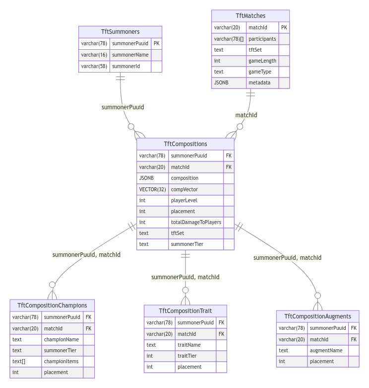

# Technical Specification for Teamfight Tactics (TFT) Data Model

## Table of Contents
- [Overview](#overview)
- [Database Tables](#database-tables)
  - [`TftSummoners`](#1-tftsummoners)
  - [`TftMatches`](#2-tftmatches)
  - [`TftCompositions`](#3-tftcompositions)
  - [`TftCompositionChampions`](#4-tftcompositionchampions)
  - [`TftCompositionTraits`](#5-tftcompositiontraits)
  - [`TftCompositionAugments`](#6-tftcompositionaugments)
- [Relationships](#relationships)
- [Constraints and Assumptions](#constraints-and-assumptions)
- [Implementation Notes](#implementation-notes)

## Overview
This document provides a detailed specification of the Teamfight Tactics (TFT) Data Model. It outlines the structure of the database tables, their relationships, and the constraints applied to ensure data integrity and consistency. This model is designed to store and manage data related to TFT Summoners, Matches, Compositions, Champions, Traits, and Augments.

## Database Tables
The data model consists of the following tables:

### 1. `TftSummoners`
This table stores information about TFT summoners.

- **summonerPuuid** (VARCHAR(78), Primary Key, Not Null): A unique identifier for the summoner.
- **summonerName** (VARCHAR(16), Not Null): The summoner's name.
- **summonerId** (VARCHAR(58), Not Null): An additional unique identifier for the summoner.

### 2. `TftMatches`
This table holds data about individual TFT matches.

- **matchId** (VARCHAR(20), Primary Key, Not Null): A unique identifier for the match.
- **participants** (VARCHAR(78)[], Not Null): An array of summoner PUUIDs who participated in the match.
- **tftSet** (TEXT, Not Null): The TFT set in which the match was played.
- **gameLength** (INT, Not Null): The duration of the match.
- **gameType** (TEXT, Not Null): The type of the game (e.g., ranked, normal).
- **metadata** (JSONB, Not Null): Additional metadata about the match.

### 3. `TftCompositions`
Stores information about the compositions used by summoners in matches.

- **summonerPuuid** (VARCHAR(78), Not Null, FK, Cascade Delete): Foreign key referencing `TftSummoners`.
- **matchId** (VARCHAR(20), Not Null, FK, Cascade Delete): Foreign key referencing `TftMatches`.
- **composition** (JSONB, Not Null): Details of the composition.
- **compVector** (VECTOR(32), Not Null): A vector representing the composition traits.
- **playerLevel** (INT, Not Null): The level of the player in the match.
- **placement** (INT, Not Null): The placement of the player in the match.
- **totalDamageToPlayers** (INT, Not Null): Total damage dealt to other players.
- **tftSet** (TEXT, Not Null): The TFT set in which the composition was used.
- **summonerTier** (TEXT, Not Null): The tier of the summoner.

### 4. `TftCompositionChampions`
Captures details about champions used in each composition.

- **summonerPuuid** (VARCHAR(78), Not Null, FK, Cascade Delete): Foreign key referencing `TftSummoners`.
- **matchId** (VARCHAR(20), Not Null, FK, Cascade Delete): Foreign key referencing `TftMatches`.
- **championName** (TEXT, Not Null): Name of the champion.
- **summonerTier** (TEXT, Not Null): The tier of the summoner.
- **championItems** (TEXT[], Not Null): Items held by the champion.
- **placement** (INT, Not Null): The placement of the player in the match.

### 5. `TftCompositionTraits`
Details of traits used in summoner compositions.

- **summonerPuuid** (VARCHAR(78), Not Null, FK, Cascade Delete): Foreign key referencing `TftSummoners`.
- **matchId** (VARCHAR(20), Not Null, FK, Cascade Delete): Foreign key referencing `TftMatches`.
- **traitName** (TEXT, Not Null): Name of the trait.
- **traitTier** (INT, Not Null): Tier of the trait.
- **placement** (INT, Not Null): The placement of the player in the match.

### 6. `TftCompositionAugments`
Information about augments used in compositions.

- **summonerPuuid** (VARCHAR(78), Not Null, FK, Cascade Delete): Foreign key referencing `TftSummoners`.
- **matchId** (VARCHAR(20), Not Null, FK, Cascade Delete): Foreign key referencing `TftMatches`.
- **augmentName** (TEXT, Not Null): Name of the augment.
- **placement** (INT, Not Null): The placement of the player in the match.

## Relationships
- Each `TftCompositions` record is tied to a specific summoner and match.
- `TftCompositionChampions`, `TftCompositionTrait`, and `TftCompositionAugments` extend `TftCompositions` with details specific to champions, traits, and augments.
- Cascade Delete: Deleting a record in `TftSummoners` or `TftMatches` will automatically delete all related records in child tables.

## Constraints and Assumptions
- `VECTOR` data type in `TftCompositions` should be supported by the database. If not, consider an alternative data type.
- Summoner tier duplication is intentional for query performance; however, this could lead to data inconsistency and should be managed appropriately.
- Ensure the database system supports array types and JSONB for efficient querying and storage.

## Implementation Notes
- Index foreign key columns for performance optimization.
- Regularly monitor and optimize queries, especially those involving JSONB data and arrays.
- Consider implementing triggers or application logic to handle cases where child table data might become orphaned (in scenarios other than cascade deletes).
